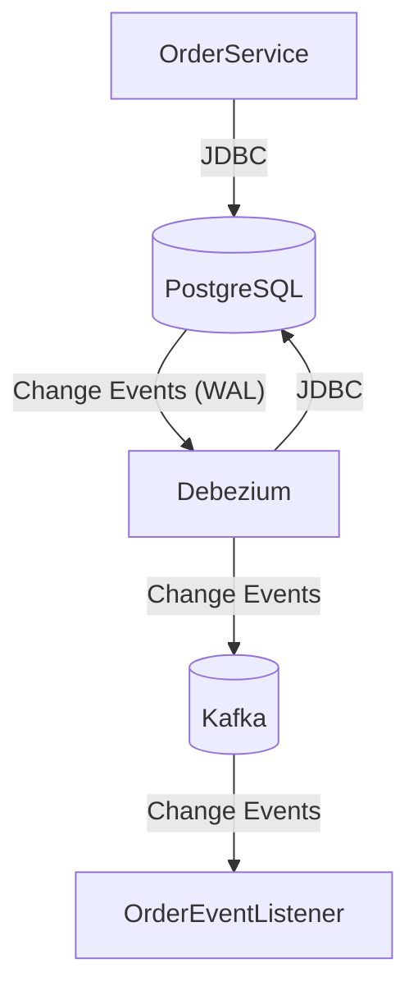
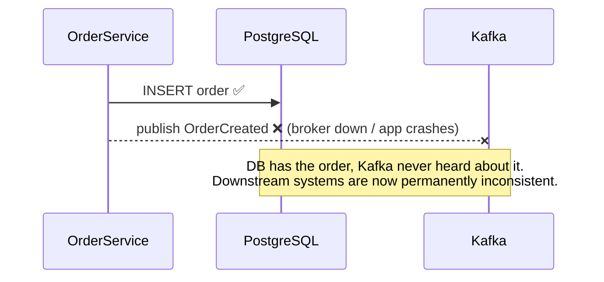
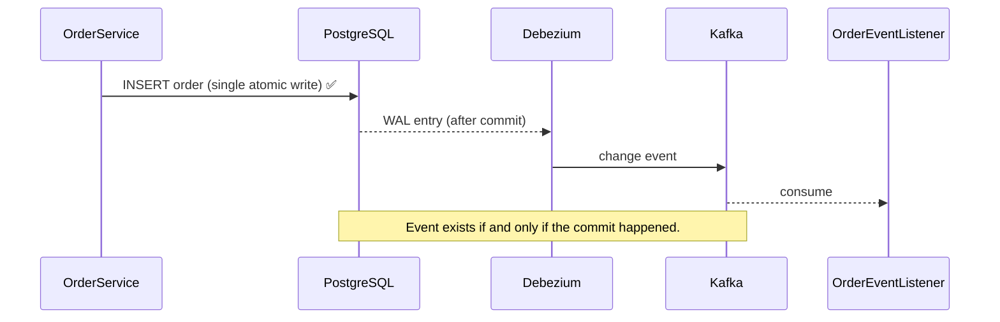
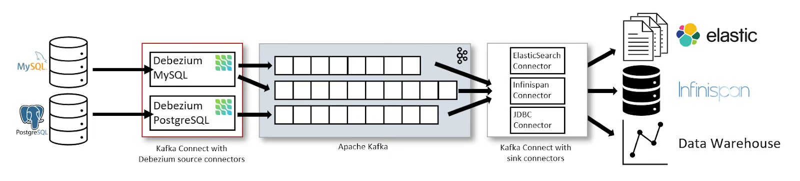
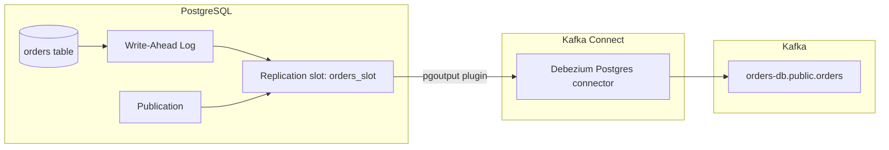
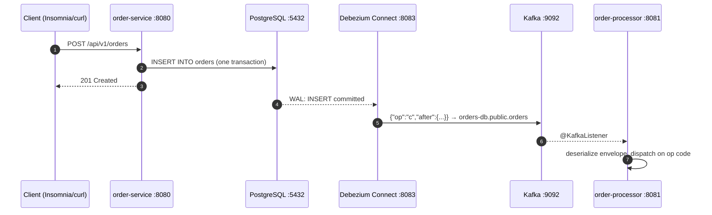

# learning-debezium-cdc

**Change Data Capture (CDC) end-to-end**: a Spring Boot service writes orders to PostgreSQL
over JDBC, Debezium tails the database write-ahead log and publishes every row change to
Kafka, and a second Spring Boot service consumes those change events in near real time.



---

## Table of contents

1. [What is Change Data Capture?](#1-what-is-change-data-capture)
2. [The problem CDC solves: dual writes](#2-the-problem-cdc-solves-dual-writes)
3. [Why Debezium?](#3-why-debezium)
4. [How Debezium captures changes from PostgreSQL](#4-how-debezium-captures-changes-from-postgresql)
5. [Project architecture](#5-project-architecture)
6. [Anatomy of a change event](#6-anatomy-of-a-change-event)
7. [Design decisions in this repo](#7-design-decisions-in-this-repo)
8. [Running the project](#8-running-the-project)
9. [Configuration profiles](#9-configuration-profiles)
10. [Testing](#10-testing)
11. [Operating the connector](#11-operating-the-connector)
12. [Production considerations & pitfalls](#12-production-considerations--pitfalls)
13. [Further reading](#13-further-reading)

---

## 1. What is Change Data Capture?

Change Data Capture is a pattern for observing every insert, update, and delete committed
to a database and turning each one into an **event** that other systems can consume. Instead
of asking the database "what changed?" on a schedule, CDC lets the database *tell you* the
moment something changes.

There are four common ways to implement it ([comparison adapted from DataCamp's CDC guide](https://www.datacamp.com/blog/change-data-capture)):

|                          | **Log-based** (what Debezium does)                      | **Trigger-based**                                          | **Polling-based**                                    | **Timestamp-based**                                  |
|--------------------------|---------------------------------------------------------|------------------------------------------------------------|------------------------------------------------------|------------------------------------------------------|
| **How it works**         | Reads the DB transaction log (WAL, binlog, redo log)    | DB triggers write every change to an audit table           | Periodically queries for changes by version/criteria | Compares an `updated_at` column against the last run |
| **Latency**              | Near real-time                                          | Immediate (fires in the transaction)                       | Poll interval                                        | Poll interval                                        |
| **Source DB overhead**   | Low — never queries the tables                          | High — trigger runs on every write                         | Moderate — repeated scan queries                     | Low–moderate                                         |
| **Complexity**           | High — needs log access, slots, connector infra         | Medium-high — triggers + audit table to maintain           | Low — plain SQL                                      | Low — if timestamps are auto-managed                 |
| **Access needed**        | Replication privilege on the log                        | DDL to create triggers                                     | Standard SQL                                         | Standard SQL                                         |
| **Captures deletes?**    | ✅ Yes, from the log                                     | ✅ Yes, if trigger logs them                                | ❌ Needs separate tracking                            | ❌ Only with soft deletes                             |
| **Intermediate states?** | ✅ Every committed change                                | ✅                                                          | ❌ Only latest state per poll                         | ❌ Only latest state per poll                         |
| **Best for**             | High-volume real-time replication, event-driven systems | Small workloads needing instant capture without log access | When neither log nor trigger access exists           | Simple batch syncs with managed timestamps           |
| **Typical tools**        | **Debezium**, AWS DMS, Striim, HVR                      | Native DB triggers                                         | Airflow + ETL scripts                                | Batch ETL jobs                                       |

Log-based CDC is the most powerful of the four: the transaction log is the database's own source
of truth for durability, so reading it guarantees you see **every committed change exactly
as it happened** — including deletes and every intermediate update — with sub-second latency
and zero impact on the tables being observed.

Typical CDC use cases:

- **Microservice data exchange** — propagate changes from one service's database to others without tight coupling
- **Transactional outbox** — publish domain events reliably (see next section)
- **Cache invalidation** — evict/update caches the instant source rows change
- **Search index sync** — keep Elasticsearch/OpenSearch in step with the primary store
- **Data warehouse / lake feeds** — stream OLTP changes into analytics systems continuously instead of nightly batch ETL
- **Audit trails** — an immutable history of every row change, for free
- **Legacy modernization (strangler fig)** — mirror a legacy database into new services without touching legacy code

## 2. The problem CDC solves: dual writes

The naive way to "save data and tell others about it" is to do both from application code:



This is the **dual-write problem**: a database and a message broker cannot be updated in one
atomic transaction. Whichever order you write them in, a crash between the two writes leaves
the system inconsistent — and no amount of retry logic fully fixes it (retries introduce
duplicates or still lose events on crash).

CDC dissolves the problem: the application performs **only one write — to its own database**.
The event stream is *derived from* the database's transaction log after commit, so it is
impossible for the data and the events to disagree:



Studies of production systems report ~99.999% transactional integrity for CDC/outbox-based
event publishing versus ~99.8% for naive dual writes — that difference is thousands of lost
or phantom events per billion transactions.

> **Related: the transactional outbox pattern.** When you want to publish *domain events*
> (rich, intentionally-designed messages) rather than raw table rows, you write the event to
> an `outbox` table in the same transaction as the business data, and let Debezium stream the
> outbox table. Debezium even ships a built-in outbox event router SMT. This repo streams the
> `orders` table directly for simplicity; the mechanics are identical.

## 3. Why Debezium?

[Debezium](https://debezium.io) is the de-facto standard open-source CDC platform, started
at Red Hat, now used at massive scale (Shopify, Vimeo, and many others). As of **July 2026
the current release series is 3.6** ([release notes](https://debezium.io/blog/2026/07/01/debezium-3-6-final-release/)),
with new connectors (YashanDB), core-wide quantile metrics, and a growing Debezium Platform
UI for pipeline monitoring.

The canonical deployment — Debezium source connectors feeding Kafka, sink connectors fanning
out to search, caches, and warehouses:



What you get over rolling your own log reader:

- **Battle-tested connectors** for PostgreSQL, MySQL/MariaDB, MongoDB, SQL Server, Oracle, Db2, Cassandra, Spanner, Vitess, Informix — one consistent event format across all of them
- **Initial snapshot + streaming**: consistent snapshot of existing data, then seamless switch to live log streaming; *incremental snapshots* let you re-snapshot tables without stopping the stream
- **At-least-once delivery** with precise offset tracking; resumes exactly where it left off after restarts
- **Rich, self-describing events**: before/after row images, operation type, source metadata (LSN, transaction id, timestamp)
- **Schema evolution handling**: DDL changes are detected and propagated
- **Single Message Transforms (SMTs)**: outbox event routing, content filtering, field renaming — declaratively in connector config
- **Runs on Kafka Connect**: scaling, fault tolerance, offset management, and a REST API come from the platform, not your code
- **Deployment flexibility**: Kafka Connect (this repo), standalone **Debezium Server** (targets Kinesis, Pub/Sub, Redis Streams, etc. — no Kafka needed), or embedded engine inside a JVM app

Alternatives and where they fit:

| Tool                       | Notes                                                                              |
|----------------------------|------------------------------------------------------------------------------------|
| **Debezium**               | Open source, richest connector set, Kafka-native. The default choice.              |
| Kafka Connect JDBC source  | Query-based polling — misses deletes, higher latency                               |
| AWS DMS                    | Managed, good for migrations into AWS; less flexible eventing                      |
| Fivetran / Airbyte         | ELT-oriented, batch-leaning; analytics pipelines rather than event-driven services |
| Native logical replication | Postgres→Postgres only; no Kafka, no event fan-out                                 |

## 4. How Debezium captures changes from PostgreSQL

PostgreSQL writes every change to its **Write-Ahead Log (WAL)** before applying it — that is
how it guarantees durability. With `wal_level=logical`, Postgres additionally writes enough
information to reconstruct *logical* row changes, and exposes them through **logical
replication slots**.



The moving parts:

- **`wal_level=logical`** — our compose file starts Postgres with this (`command: postgres -c wal_level=logical`)
- **Replication slot** (`orders_slot`) — the server-side cursor that remembers how far the consumer has read; Postgres retains WAL until the slot has consumed it
- **Publication** — declares which tables' changes are exposed (we use `publication.autocreate.mode=all_tables`)
- **`pgoutput`** — Postgres's built-in logical decoding plugin (no extension install needed, unlike the older `wal2json`/`decoderbufs`)
- **Snapshot** — on first start (`snapshot.mode=initial`) Debezium reads all existing rows as `op: "r"` events, then switches to streaming the WAL

Lifecycle on `docker compose up`:

1. `connect-init` registers `orders-connector.json` with the Kafka Connect REST API
2. The connector creates the replication slot and publication, snapshots (empty at first — Flyway hasn't run), and starts streaming
3. `order-service` boots, Flyway creates the `orders` table — because the publication covers *all tables*, changes flow immediately with no connector restart
4. Every committed change to `orders` appears on the Kafka topic `orders-db.public.orders` within milliseconds

## 5. Project architecture

### Modules

| Module            | Port | Role                                                                                    |
|-------------------|------|-----------------------------------------------------------------------------------------|
| `order-service`   | 8080 | REST API for orders; owns the schema via Flyway; the CDC **source**                     |
| `order-processor` | 8081 | Kafka consumer that deserializes and processes Debezium change events; the CDC **sink** |

Both are Spring Boot 4 / Java 25 modules under a root POM that inherits the shared
`super-pom` (BOM-managed versions, enforcer, surefire/failsafe, git-commit-id, pitest and
OWASP profiles) — same conventions as the sibling `learning-*` projects.

### Infrastructure (`docker-compose.yml`)

| Service        | Container               | Port | Notes                                  |
|----------------|-------------------------|------|----------------------------------------|
| `postgres`     | `debezium-postgres`     | 5432 | Postgres 17, `wal_level=logical`       |
| `kafka`        | `debezium-kafka`        | 9092 | KRaft mode — no Zookeeper              |
| `connect`      | `debezium-connect`      | 8083 | Debezium Kafka Connect worker          |
| `connect-init` | `debezium-connect-init` | —    | One-shot curl: registers the connector |
| `kafdrop`      | `debezium-kafdrop`      | 9000 | Kafka web UI — browse the topic        |

### End-to-end flow



## 6. Anatomy of a change event

The connector runs with `value.converter.schemas.enable=false` (no verbose inline schema)
and `decimal.handling.mode=string` (NUMERIC arrives as `"1299.99"` instead of base64-encoded
binary), so messages on `orders-db.public.orders` are the plain Debezium envelope:

```json
{
  "before": null,
  "after": {
    "id": 1,
    "customer_id": "customer-1",
    "product": "laptop",
    "quantity": 2,
    "price": "1299.99",
    "status": "NEW",
    "created_at": "2026-07-11T10:15:30.123456Z",
    "updated_at": "2026-07-11T10:15:30.123456Z"
  },
  "source": { "db": "orders_db", "schema": "public", "table": "orders", "lsn": "24023928" },
  "op": "c",
  "ts_ms": 1783937730456
}
```

| `op` | Meaning       | `before` | `after`      |
|------|---------------|----------|--------------|
| `c`  | insert        | `null`   | new row      |
| `u`  | update        | old row¹ | new row      |
| `d`  | delete        | old row¹ | `null`       |
| `r`  | snapshot read | `null`   | existing row |

¹ Only because the migration sets `ALTER TABLE orders REPLICA IDENTITY FULL` — by default
Postgres logs just the primary key of the old row, so `before` would contain only `id`.
Full before-images are what make diff-based consumers (audit, cache patching) possible.

**Tombstones**: after every delete event Debezium emits a second record with the same key
and a `null` value. This is for Kafka **log compaction** — a compacted topic drops all
records for a key once it sees the tombstone. `OrderEventListener` handles them explicitly.

The message **key** is the primary key (`{"id": 1}`), which puts all events for one order on
the same partition — Kafka then guarantees consumers see that order's changes **in order**.

## 7. Design decisions in this repo

| Decision                                                   | Why                                                                                                                                                                                                                                                             |
|------------------------------------------------------------|-----------------------------------------------------------------------------------------------------------------------------------------------------------------------------------------------------------------------------------------------------------------|
| **Flyway owns the schema**, Hibernate `ddl-auto: validate` | Deterministic, versioned DDL; the CDC-critical `REPLICA IDENTITY FULL` lives in `V1__create_orders_table.sql` where it can't be forgotten                                                                                                                       |
| `publication.autocreate.mode=all_tables`                   | The connector registers at compose-up, *before* Flyway has created the table. A filtered publication would fail on the missing table; an all-tables publication tolerates tables appearing later (`table.include.list` still filters what's published to Kafka) |
| `decimal.handling.mode=string`                             | Default emits NUMERIC as base64 bytes (exact but unreadable); `string` keeps precision and stays human-readable                                                                                                                                                 |
| Converter schemas disabled                                 | Envelope-only JSON, ~5× smaller messages; use Avro + Schema Registry in production instead                                                                                                                                                                      |
| `tombstones.on.delete=true`                                | Keeps the topic compaction-ready                                                                                                                                                                                                                                |
| `DefaultErrorHandler` with backoff + skip                  | A poison message must not block the CDC stream — retry twice, log, move on (use a dead-letter topic in production)                                                                                                                                              |
| Container names prefixed `debezium-`                       | Bare names like `kafka` collide with the other `learning-*` project stacks on the same machine                                                                                                                                                                  |
| One-shot `connect-init` service                            | `docker compose up -d` yields a fully wired pipeline, no manual REST call                                                                                                                                                                                       |

## 8. Running the project

```bash
# 1. Infrastructure (connector registers automatically)
docker compose up -d

# 2. Services (separate terminals)
mvn spring-boot:run -pl order-service
mvn spring-boot:run -pl order-processor
```

### Try it

Import `learning-debezium-cdc.insomnia.json` into Insomnia (folders for Orders CRUD,
Debezium Connect admin, and actuator health), or use curl:

```bash
# Create — watch order-processor log the CREATE event
curl -s -X POST localhost:8080/api/v1/orders \
  -H 'Content-Type: application/json' \
  -d '{"customerId":"customer-1","product":"laptop","quantity":2,"price":1299.99}'

# Update status — UPDATE event with full before/after images
curl -s -X PATCH localhost:8080/api/v1/orders/1/status \
  -H 'Content-Type: application/json' -d '{"status":"CONFIRMED"}'

# Delete — DELETE event followed by a tombstone
curl -s -X DELETE localhost:8080/api/v1/orders/1
```

UIs:

- Swagger: <http://localhost:8080/swagger-ui.html>
- Kafdrop (topic browser): <http://localhost:9000> → topic `orders-db.public.orders`
- Connect REST: <http://localhost:8083/connectors/orders-connector/status>

## 9. Configuration profiles

There is no `application.yml` — each profile has its own complete file:

```
src/main/resources/
├── application-local.yml   # localhost infra, DEBUG logging
├── application-prod.yml    # prod hosts, credentials from env vars, INFO logging
└── banner.txt
```

`local` is the fallback (`spring.profiles.default` set in each main class). Pick another
profile the usual way:

```bash
mvn spring-boot:run -pl order-service -Dspring-boot.run.profiles=prod
# or: SPRING_PROFILES_ACTIVE=prod java -jar order-service.jar
```

## 10. Testing

```bash
mvn test
```

| Test                                  | Kind                      | Proves                                                       |
|---------------------------------------|---------------------------|--------------------------------------------------------------|
| `OrderControllerUnitTest`             | `@WebMvcTest`             | validation, status codes, error advice                       |
| `OrderControllerIntegrationTest`      | Testcontainers PostgreSQL | Flyway migration + full CRUD against real Postgres           |
| `OrderChangeEventDeserializationTest` | plain JUnit               | Debezium envelope → records mapping (create + delete shapes) |
| `OrderEventListenerIntegrationTest`   | `@EmbeddedKafka`          | listener consumes and parses events end-to-end               |

Test sources follow the house convention: `src/test/java/unit` and `src/test/java/intg`,
wired via `build-helper-maven-plugin`. Integration tests need Docker.

## 11. Operating the connector

Everything is driven through the Kafka Connect REST API (also available in the Insomnia
collection):

```bash
curl -s localhost:8083/connectors                                  # list
curl -s localhost:8083/connectors/orders-connector/status          # health
curl -s -X POST localhost:8083/connectors/orders-connector/restart # restart
curl -s -X DELETE localhost:8083/connectors/orders-connector       # remove
./register-connector.sh                                    # (re)register manually
```

Useful Postgres-side checks:

```sql
SELECT slot_name, active, confirmed_flush_lsn FROM pg_replication_slots;
SELECT * FROM pg_publication;
SELECT pg_size_pretty(pg_wal_lsn_diff(pg_current_wal_lsn(), confirmed_flush_lsn))
  AS retained_wal FROM pg_replication_slots;   -- how much WAL the slot is holding back
```

## 12. Production considerations & pitfalls

- **Replication slot ↔ disk growth.** Postgres retains WAL until the slot consumes it. If
  the connector is down for a long weekend, WAL piles up and can fill the disk. Monitor
  `retained_wal` (query above) and set `max_slot_wal_keep_size` as a circuit breaker.
- **Delivery is at-least-once.** After a crash the connector may re-emit events it already
  sent. Consumers must be **idempotent** (upserts keyed on primary key + LSN work well).
- **Ordering is per key, not global.** Events for one order are ordered (same partition);
  events across orders are not.
- **Snapshots of big tables block.** `snapshot.mode=initial` reads whole tables; for large
  databases use *incremental snapshots* (`signal` table) to backfill without stopping the stream.
- **Schema evolution.** Adding nullable columns is seamless. Renames/drops ripple into every
  consumer — in production use Avro + Schema Registry and compatibility rules instead of
  schemaless JSON.
- **Don't leak your table model.** Streaming raw tables couples consumers to your schema.
  For service-to-service contracts, prefer the **outbox pattern** (Debezium's outbox SMT)
  so events are deliberately designed messages.
- **Secure the pipeline.** This repo uses superuser `postgres` for simplicity; production
  wants a dedicated user with only `REPLICATION` + `SELECT` on captured tables, TLS to both
  Postgres and Kafka, and secrets from a vault (Connect supports config providers).
- **Version note.** Compose pins `quay.io/debezium/connect:3.1`; the current series is
  **3.6** (July 2026). Upgrades are usually drop-in — offsets and slot survive — but read
  the [release notes](https://debezium.io/releases/) before bumping majors.

## 13. Further reading

- [Debezium documentation](https://debezium.io/documentation/) · [PostgreSQL connector reference](https://debezium.io/documentation/reference/stable/connectors/postgresql.html)
- [Debezium releases overview](https://debezium.io/releases/) · [Debezium 3.6 release announcement](https://debezium.io/blog/2026/07/01/debezium-3-6-final-release/)
- [Transactional outbox — AWS Prescriptive Guidance](https://docs.aws.amazon.com/prescriptive-guidance/latest/cloud-design-patterns/transactional-outbox.html)
- [CDC for microservices & event-driven architectures — Conduktor](https://www.conduktor.io/glossary/cdc-for-microservices-event-driven-architectures)
- [Solving dual writes with CDC and outbox](https://medium.com/@mohantyshyama/designing-fault-tolerant-systems-solving-dual-writes-with-cdc-and-outbox-dd9a4ee727bb)
- [Outbox pattern explained — Streamkap](https://streamkap.com/resources-and-guides/outbox-pattern-explained)
- [PostgreSQL logical decoding docs](https://www.postgresql.org/docs/current/logicaldecoding.html)
